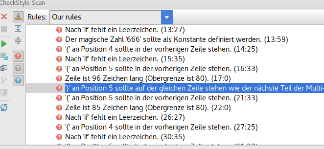
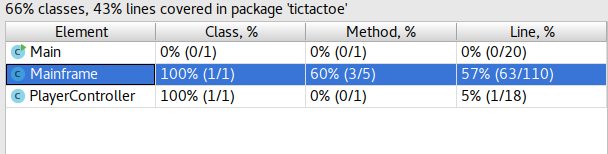

class: center, middle

# Statische Code-Analyse

***von Alexej Esau und Ruben Gees***

---

# Inhalt

- Was ist statische Code-Analyse?

- Einheitlicher Code-Stil mit `Checkstyle`

- Automatisiert Fehler finden mit `FindBugs`

- Code Coverage prüfen mit `JaCoCo`

- Alles zusammenbringen mit `SonarQube`

- Zusammenfassung

- Ausblick

- Quellen

---

# Statische Code-Analyse

.left-column[
## Was?
]

.right-column[
*"Statische Code-Analyse oder kurz statische Analyse ist ein statisches
Software-Testverfahren, das zur Übersetzungszeit durchgeführt wird. Der
Quelltext wird hierbei einer Reihe formaler Prüfungen unterzogen, bei denen
bestimmte Sorten von Fehlern entdeckt werden können, noch bevor die
entsprechende Software (z. B. im Modultest) ausgeführt wird."*

*Quelle: https://de.wikipedia.org/wiki/Statische_Code-Analyse*
]

---

# Statische Code-Analyse

.left-column[
## Was?
]

.right-column[
## Arten

- Code-Stil-Analyse

- Code Smells

- Fehlersuche (potenzieller Fehler)

- Metriken
    - Testabdeckung
    - Komplexizität
    - Wartbarkeit

- Architektur-Analyse

- ...
]

---

# Statische Code-Analyse

.left-column[
## Was?
## Wofür?
]

.right-column[
- Unterstützung bei der Arbeit
    - Automatisierung musterbasierter Routine-Checks
    - Aufdeckung potenzieller Fehlerquellen
    - Aufzeigen von Potenzialen

- Visualisierung der Code-Qualität
]

---

# Statische Code-Analyse

.left-column[
## Was?
## Wofür?
## Wie?
]

.right-column.center.img[

]

---

class: center, middle

.title-image[]

---

# Checkstyle

.left-column[
## Was?
]

.right-column[
- Automatisiertes Validieren des (Java-)Code-Stils gegen definierte Regeln

- Aktuelle Version (Juni 2017): `7.8`

- Lizenz: `GNU LGPL v2.1`

- Aktive Weiterentwicklung auf https://github.com/checkstyle/checkstyle

- Monatliches Release (sofern Änderungen vorhanden)

- 100% Coverage!
]

---

# Checkstyle

.left-column[
## Was?
## Wofür?
]

.right-column[
- Projektweit einheitlicher Code-Stil

- Vereinfachung der Code-Reviews
]

???

- Jeder Entwickler hat seinen eigenen Stil

- Code-Reviews können sich verstärkt auf inhaltliche Korrektheit konzentrieren
  und müssen sich nicht mehr um simple Stil-Fehler kümmern

---

# Checkstyle

.left-column[
## Was?
## Wofür?
## Wie?
]

.right-column[
- Regelwerk via XML konfigurierbar

- Regelwerk

    - Sammlung von Modulen

- Modul

    - Durch Checkstyle ausführbare Einheit

    - Sammlung von Eigenschaften und Modulen

- Eigenschaft

    - Einstellung für das übergeordnete Modul

- Verwendung vordefinierter und/oder eigener Module möglich
]

---

# Checkstyle

.left-column[
## Was?
## Wofür?
## Wie?
]

.right-column[
```xml
<module name="Checker">
  <module name="TreeWalker">
    <module name="MethodLength">
      <property name="tokens" value="METHOD_DEF"/>
    </module>
    <module name="MethodLength">
      <property name="tokens" value="CTOR_DEF"/>
      <property name="max" value="60"/>
    </module>
  </module>
</module>
```

- Alle Module unterstehen dem `Checker`-Modul.

- Wichtige `Eigenschaften`: `baseDir` und `charset`. Es gibt noch viele
[weitere](http://checkstyle.sourceforge.net/config.html#Checker).

- `TreeWalker`-Modul ist das wichtigste

    - Aufruf von Modulen wenn Token gefuden wird
]

---

# Checkstyle

.left-column[
## Was?
## Wofür?
## Wie?
]

.right-column[
- Gewichtung von Modulen

    ```xml
    <module name="Translation">
      <property name="severity" value="warning"/>
    </module>
    ```

- Meldung bei Regelverstoß

    ```xml
    <module name="MemberName">
      <message key="name.invalidPattern"
               value="Member ''{0}'' is wrong!" />
    </module>
    ```

- Eigene Module mit
[RegEx](https://de.wikipedia.org/wiki/Regul%C3%A4rer_Ausdruck)

    ```xml
    <!-- Findet Floats, die nicht  -->
    <!-- dem Format 3f entsprechen. -->
    <module name="RegexpSinglelineJava">
      <property name="format" value="[^\w][\d]+\.f"/>
    </module>
    ```
]

---

# Checkstyle

.left-column[
## Was?
## Wofür?
## Wie?
]

.right-column[
- Einzelne Probleme ignorieren

    ```xml
    <module name="SuppressionFilter">
      <property name="file" value="cs_suppressions.xml" />
    </module>
    ```

- Neue Datei: `cs_suppressions.xml`.

    ```xml
    <suppressions>
      <suppress files="[\w]*Test.java" checks="SomeCheck"/>
    </suppressions>
    ```

- Ignorieren direkt im Code

    ```java
    @SuppressWarnings("checkstyle:nestedifdepth")
    public void someMethod() {
        // Many nested structures.
    }
    ```
]

---

# Checkstyle

.left-column[
## Was?
## Wofür?
## Wie?
]

.right-column[
- Vordefinierte Regelwerke

    - Google: http://checkstyle.sourceforge.net/google_style.html

    - Sun: http://checkstyle.sourceforge.net/sun_style.html
]

---

# Checkstyle

.left-column[
## Was?
## Wofür?
## Wie?
## Anwendung
]

.right-column[
## Möglichkeit 1: CLI

```bash
java -jar checkstyle.jar -c checkstyle.xml MyClass.java
```

- Zahlreiche Konfigurationsmöglichkeiten:

    - Ausgabeformat mit `-f` (`plain`/`xml`)

    - Ausgabedatei mit `-o`

    - Dateien zum Ignorieren mit `-e` oder `-x` (RegEx)

#### Aufruf und Ausgabe


]

---

# Checkstyle

.left-column[
## Was?
## Wofür?
## Wie?
## Anwendung
]

.right-column[
## Möglichkeit 2: IDE Plugin (IntelliJ)

#### Live Highlighting


]

---

# Checkstyle

.left-column[
## Was?
## Wofür?
## Wie?
## Anwendung
]

.right-column[
## Möglichkeit 2: IDE Plugin (IntelliJ)

#### Manuelles Scannen


]

---

# Checkstyle

.left-column[
## Was?
## Wofür?
## Wie?
## Anwendung
]

.right-column[
## Möglichkeit 2: IDE Plugin (IntelliJ)

#### Neue Konfiguration anlegen

.center-image[]
]

---

# Checkstyle

.left-column[
## Was?
## Wofür?
## Wie?
## Anwendung
]

.right-column[
## Möglichkeit 2: IDE Plugin (IntelliJ)

#### Alle Konfigurationsmöglichkeiten

.center-image[]
]

---

# Checkstyle

.left-column[
## Was?
## Wofür?
## Wie?
## Anwendung
]

.right-column[
## Möglichkeit 3: Build-Tool (Gradle)

- Neue Tasks: `checkstyleMain` und `checkstyleTest`

- Ausführung während des `check`-Tasks

#### Ausgabe auf der Konsole


]

---

# Checkstyle

.left-column[
## Was?
## Wofür?
## Wie?
## Anwendung
]

.right-column[
## Möglichkeit 3: Build-Tool (Gradle)

#### Generierte Report Datei (`build/reports/main.html`)

.center-image[]
]

---

# Checkstyle

.left-column[
## Was?
## Wofür?
## Wie?
## Anwendung
]

.right-column[
## Möglichkeit 3: Build-Tool (Gradle)

- Standart config Datei: `config/checkstyle/checkstyle.xml`

- Eigener Pfad auch möglich

#### Konfiguration in `build.gradle`

```groovy
apply plugin: "checkstyle"

checkstyle {
    configFile = file("config/checkstyle/sun_checks.xml")
}
```
]

---

# JaCoCo

.left-column[
## Was?
]

.right-column[
- Generieren von Test-Coverage Auswertungen

- Aktuelle Version (Juni 2017): `0.7.9`

- Lizenz: `Eclipse Public License Version 1.0 ("EPL")`

- Aktive Weiterentwicklung

- Integration mit sehr vielen Tools und Systemen

- Eigene [Mailinglist](https://groups.google.com/forum/?fromgroups=#!forum/jacoco)
]

---

# JaCoCo

.left-column[
## Was?
## Warum?
]

.right-column[
- Übersicht über getesten Code

- Einfaches Finden von nicht ausreichend getestetem Code

- Gefühl der Sicherheit
]

---

# JaCoCo

.left-column[
## Was?
## Warum?
## Wie?
]

.right-column[
- Arbeitet auf JVM-Bytecode

    - Eigentlicher Quellcode nicht nötig

- `Instructions`, `Branches`, `Cyclomatic Complexity`, `Lines`, `Methods` und
  `Classes` werden untersucht
]

???

Instructions: C0 Anzahl der Instructions  
Branches: C1 Anzahl der durchlaufenen Branches  
Cyclomatic: Minimale Anzahl an Pfaden um alles in der Methode abzudecken  
Lines:

| Eigenschaft | Beschreibung |
| ----------- | :------------: |
| No          | Garnicht ausgeführt |  
| Partial     | Ein Teil der Zeile wurde ausgeführt |  
| Full        | Alles  

Classes: Mindestens eine Komponente der Klasse wurde ausgeführt

---

# JaCoCo

.left-column[
## Was?
## Warum?
## Wie?
## Anwendung
]

.right-column[
## Möglichkeit 1: IDE (IntelliJ)

- Benötigtes Plugin: `Coverage`

#### Ausführen mit Coverage


]

---

# JaCoCo

.left-column[
## Was?
## Warum?
## Wie?
## Anwendung
]

.right-column[
## Möglichkeit 1: IDE (IntelliJ)

#### Ergebnis: Übersicht


]

---

# JaCoCo

.left-column[
## Was?
## Warum?
## Wie?
## Anwendung
]

.right-column[
## Möglichkeit 1: IDE (IntelliJ)

#### Ergebnis: Klassen pro Package


]

---

# JaCoCo

.left-column[
## Was?
## Warum?
## Wie?
## Anwendung
]

.right-column[
## Möglichkeit 1: IDE (IntelliJ)

#### Marker im Code

.center-image[]
]

---

# JaCoCo

.left-column[
## Was?
## Warum?
## Wie?
## Anwendung
]

.right-column[
## Möglichkeit 1: IDE (IntelliJ)

#### Konfiguration

.center-image[]
]

---

# JaCoCo

.left-column[
## Was?
## Warum?
## Wie?
## Anwendung
]

.right-column[
## Möglichkeit 2: Build-Tool (Gradle)

- Neue Tasks: `jacocoTestCoverageVerification` und `jacocoTestReport`

- Muss nach dem `check` oder `test` Task ausgeführt werden.

- Report-Datei wird generiert, kein Konsolen Output
]

---

# JaCoCo

.left-column[
## Was?
## Warum?
## Wie?
## Anwendung
]

.right-column[
## Möglichkeit 2: Build-Tool (Gradle)

#### Übersicht


]

---

# JaCoCo

.left-column[
## Was?
## Warum?
## Wie?
## Anwendung
]

.right-column[
## Möglichkeit 2: Build-Tool (Gradle)

#### Zeilenabdeckung

.center-image[]
]

---

class: center, middle

# Demo

---

class: center, middle

.title-image[]

---

layout: true

# FindBugs

---

.left-column[
## Was?
]

.right-column[
## Allgemein

- Untersucht Java-Bytecode auf bekannte Fehlermuster

- Aktuelle Version (Juni 2017): `3.0.1`

- Lizenz: `LGPL`

- Entwicklungs-Status: Semi-Aktiv (https://github.com/findbugsproject/findbugs)

- Initiiert durch University of Maryland
    - 2003
]

---

.left-column[
## Was?
]

.right-column[
## Konkreter

- Analyse anhand von Bug Pattern
    - Sowas wie Anti Pattern

- Erweiterung über Plugin-Architektur
    - Java-Bytecode KnowHow nötig

- Varianten
    - Standalone (CLI + GUI + TUI)
    - Build Tool Plugins
    - IDE Plugins
]

---

.left-column[
## Was?
## Wofür?
]

.right-column[
- Aufdecken potenzieller Fehler
    - False positives möglich

- Gründe für Fehler
    - Komplizierte/Missverstandene Sprach-Features
    - Missverstandene APIs
    - Missverständnis nach Code-Refactorings
    - Tippfehler
        - `==` statt `!=`
]

---

.left-column[
## Was?
## Wofür?
## Wie?
]

.right-column[
## Filter

- Filter-Definition als XML-Datei(en)
    - http://findbugs.sourceforge.net/manual/filter.html

- Verwendung als ...
    - include
    - exclude
]

---

.left-column[
## Was?
## Wofür?
## Wie?
]

.right-column[
## Filter (Beispiel)

```xml
<!-- excludes.xml -->
<FindBugsFilter>
    <!-- All bugs in test classes, except for JUnit-specific bugs. -->
    <Match>
        <Class name="~.*\.*Test" />
        <Not>
            <Bug code="IJU" />
        </Not>
    </Match>
    <!-- Ignore DTOs/beans. -->
    <Match>
        <Package name="~.*\.persistence\.dto" />
    </Match>
</FindBugsFilter>
```
]

---

.left-column[
## Was?
## Wofür?
## Wie?
]

.right-column[
## Filter (Beispiel)

```xml
<!-- excludes.xml -->
<FindBugsFilter>
     <Match>
        <Class name="foo.bar.Foobar" />
        <Method name="writeDataToFile" />
        <Bug pattern="OS_OPEN_STREAM" />
    </Match>
</FindBugsFilter>
```
]

---

.left-column[
## Was?
## Wofür?
## Wie?
]

.right-column[
## Filter (Beispiel)

```xml
<!-- excludes.xml -->
<FindBugsFilter>
    <!-- Match all XYZ violations. -->
    <Match>
        <Bug code="XYZ" />
    </Match>

    <!-- Match all doublecheck violations in these methods of "AnotherClass". -->
    <Match>
        <Class name="com.foobar.AnotherClass" />
        <Or>
            <Method name="nonOverloadedMethod" />
            <Method name="foo" params="int,java.lang.String" returns="void" />
            <Method name="bar" params="" returns="boolean" />
        </Or>
        <Bug code="DC" />
    </Match>
</FindBugsFilter>
```
]

---

.left-column[
## Was?
## Wofür?
## Wie?
]

.right-column[
## Interessante Optionen

- `-include` / `-exclude`
    - Bug-Reports einbeziehen / ignorieren

- Ausgabeformate
    - `-xml`
    - `-html`
    - `-xdoc`
    - `-emacs`
]

---

.left-column[
## Was?
## Wofür?
## Wie?
]

.right-column[
## Interessante Optionen

- `-low` / `-medium` (Standard) / `-high`
    - Alle / Mittlere + Hohe Prio / Hohe Prio

- `-relaxed`
    - Versucht false-positives zu erkennen und rauszufiltern
]

---

.left-column[
## Was?
## Wofür?
## Wie?
]

.right-column[
## Interessante Optionen

- `-effort:min`
    - Weniger intensive Analyse
    - Weniger Speicherverbrauch
    - Schneller

- `-effort:max`
    - Sehr intensive Analyse
    - Höherer Speicherverbrauch
    - Zeitintensiver

- `-effort:default` (Standard)
    - irgendwas zwischen `min` und `max`
]

---

.left-column[
## Was?
## Wofür?
## Wie?
## Anwendung
]

.right-column[
## CLI

```bash
java -jar findbugs.jar -exclude excludes.xml -output findbugs-report.xml -xml:withMessages -effort:max -low app.jar
```


]

---

.left-column[
## Was?
## Wofür?
## Wie?
## Anwendung
]

.right-column[
## Gradle

```groovy
// build.gradle

// ...

apply plugin: "findbugs"

// ...

findbugs {
    ignoreFailures: true
}

// ...
```
]

---

.left-column[
## Was?
## Wofür?
## Wie?
## Anwendung
]

.right-column[
## Gradle

```bash
./gradlew clean check # findbugsMain findbugsTest
```


]

---

.left-column[
## Was?
## Wofür?
## Wie?
## Anwendung
]

.right-column[
## IDE-Plugin (IDEA)


]

---

.left-column[
## Was?
## Wofür?
## Wie?
## Anwendung
]

.right-column[
## IDE-Plugin (IDEA)


]

---

.left-column[
## Was?
## Wofür?
## Wie?
## Anwendung
]

.right-column[
## IDE-Plugin (IDEA)


]

---

.left-column[
## Was?
## Wofür?
## Wie?
## Anwendung
]

.right-column[
## IDE-Plugin (IDEA)


]

---

.left-column[
## Was?
## Wofür?
## Wie?
## Anwendung
]

.right-column[
## IDE-Plugin (IDEA)


]

---

.left-column[
## Was?
## Wofür?
## Wie?
## Anwendung
]

.right-column[
## IDE-Plugin (IDEA)


]

---

.left-column[
## Was?
## Wofür?
## Wie?
## Anwendung
]

.right-column[
## IDE-Plugin (IDEA)


]

---

layout: true

---

class: center, middle

# Demo

---

class: center, middle


---

class: center, middle

# Demo

---

class: center, middle


---

layout: true

# SonarQube

---

.left-column[
## Was?
]

.right-column[
## Allgemeines

- Plattform zur Auswertung und Visualisierung von Daten gewonnen durch
    statische Code-Analyse

- Version (Juni 2017): `6.4` bzw. `5.6.6 LTS`

- Lizenz: `GNU LGPL v3.0`

- Entwicklungs-Status: Aktiv (https://github.com/sonarsource/sonarqube)

- Entwicklung durch SonarSource S.A.
    - Seit 2008
]

???

- SonarSource S.A. ist ein schweizer Unternehmen

---

.left-column[
## Was?
]

.right-column[
## Etwas konkreter

- Webapp
    - Visualisierung der Auswertung
    - Management (Benutzer, Projekte, Regeln, Quality Gates, Plugins, Issues, ...)
    - Reviews / Diskussionen

- Datenbank
    - Persistierung

- Scanner
    - Durchführung der Auswertung
]

---

.left-column[
## Was?
]

.right-column[
## Webapp


]

---

.left-column[
## Was?
]

.right-column[
## Webapp


]

---

.left-column[
## Was?
]

.right-column[
## Webapp


]

---

.left-column[
## Was?
]

.right-column[
## Webapp


]

---

.left-column[
## Was?
]

.right-column[
## Webapp


]

---

.left-column[
## Was?
]

.right-column[
## Webapp


]

---

.left-column[
## Was?
]

.right-column[
## nice2know

- 20+ Code Analyzers
    - `Java`, `C/C++`, `Objective-C`, `Swift`, `C#`, `VB.NET`, `VB6`,
        `PHP`, `XML`, `HTML`, `CSS/Less/Sass`, `JavaScript`, `COBOL`, `ABAP`,
        `SQL`, ...

- 3.000+ Regeln

- Von 80.000+ Organisationen verwendet
]

---

.left-column[
## Was?
]

.right-column[
## Geschmacksrichtungen

- self-hosted
    - https://sonarqube.org/downloads

- Cloud
    - https://sonarqube.com bzw. https://sonarcloud.io
]

---

.left-column[
## Was?
## Wofür?
]

.right-column[
## Webapp

- Zentrale Anlaufstelle
    - Visualisierung von Analysen
    - Sammeln von Analyse-Daten aus statischer Code-Analyse
    - Verwaltung von Regeln und Quality Gates
        - Projektspezifisch (ein Projekt)
        - Projektübergreifend (mehrere Projekte / unternehmensweit?)
    - Reviews / Diskussionen
    - Unabhänigkeit von IDEs / Editoren und Entwicklern
]

---

.left-column[
## Was?
## Wofür?
]

.right-column[
## Scanner

- Analyse des Codes

- Standalone Scanner / Build Tool Scanner
    - Transfer der Analyse zu SonarQube

- IDE-Plugins
    - IDE-interne Visualisierung der Analyse
]

---

.left-column[
## Was?
## Wofür?
## Wie?
]

.right-column[
## Webapp

- Installation notwendiger Scanner-Plugins (Regelwerke)

- Profile erstellen / konfigurieren (Regeln zuordnen)

- Profile den Projekten zuordnen
]

---

.left-column[
## Was?
## Wofür?
## Wie?
]

.right-column[
## Scanner

- Verbindung zum Server konfigurieren

- Scanner starten
]

---

.left-column[
## Was?
## Wofür?
## Wie?
]

.right-column[
## Ablauf


]

---

.left-column[
## Was?
## Wofür?
## Wie?
## Anwendung
]

.right-column[
## SonarQube Scanner


]

---

.left-column[
## Was?
## Wofür?
## Wie?
## Anwendung
]

.right-column[
## CLI Scanner

```properties
# conf/sonar-scanner.properties

sonar.host.url=https://puck257.startdedicated.de/sonarqube
# Set key or user name to login
sonar.login=MyGeneratedAndVerySecretKey
# Only needed when using user name
#sonar.password=
sonar.projectKey=static-code-analysis-presentation-demo:master
sonar.projectName=static-code-analysis-presentation-demo
sonar.projectVersion=1.0-SNAPSHOT
sonar.sources=src/
sonar.sourceEncoding=UTF-8
```

```bash
# run the scanner
sonar-scanner
```
]

---

.left-column[
## Was?
## Wofür?
## Wie?
## Anwendung
]

.right-column[
## Gradle

```groovy
// build.gradle

buildscript {
    repositories {
        maven { url "https://plugins.gradle.org/m2/" }
        jcenter()
    }

    dependencies {
        classpath "org.sonarsource.scanner.gradle:sonarqube-gradle-plugin:2.4"
    }
}

apply plugin: "org.sonarqube"

// ... ->
```
]

---

.left-column[
## Was?
## Wofür?
## Wie?
## Anwendung
]

.right-column[
## Gradle

```groovy
// build.gradle

// ... ->

sonarqube {
    properties {
        property "sonar.host.url", "https://puck257.startdedicated.de/sonarqube"
        property "sonar.login" "MyGeneratedAndVerySecretKey"
        property "sonar.projectName", "static-code-analysis-presentation-demo"
        property "sonar.projectKey", "static-code-analysis-presentation-demo:master"
    }
}
```

```bash
# run the scanner
gradle clean check sonarqube
```
]

---

.left-column[
## Was?
## Wofür?
## Wie?
## Anwendung
]

.right-column[
## SonarLint (IDEA)


]

---

.left-column[
## Was?
## Wofür?
## Wie?
## Anwendung
]

.right-column[
## SonarLint (IDEA)


]

---

.left-column[
## Was?
## Wofür?
## Wie?
## Anwendung
]

.right-column[
## SonarLint (IDEA)


]

---

.left-column[
## Was?
## Wofür?
## Wie?
## Anwendung
]

.right-column[
## SonarLint (IDEA)


]

---

.left-column[
## Was?
## Wofür?
## Wie?
## Anwendung
]

.right-column[
## SonarLint (IDEA)


]

---

.left-column[
## Was?
## Wofür?
## Wie?
## Anwendung
]

.right-column[
## SonarLint (IDEA)


]

---

layout: true

---

class: center, middle

# Demo

---

# Zusammenfassung

_TODO_

---

# Ausblick

_TODO_

---

# Quellen

- http://checkstyle.sourceforge.net/
- https://github.com/checkstyle/checkstyle
- https://plugins.jetbrains.com/plugin/1065-checkstyle-idea
- https://docs.gradle.org/3.3/userguide/checkstyle_plugin.html
- http://findbugs.sourceforge.net
- http://findbugs.sourceforge.net/manual/index.html
- https://de.wikipedia.org/wiki/FindBugs
- http://www.fh-wedel.de/~si/seminare/ws08/Ausarbeitung/11.ca/findbugs.html
- https://plugins.jetbrains.com/plugin/3847-findbugs-idea
- https://de.wikipedia.org/wiki/SonarQube
- https://www.sonarqube.org
- https://www.sonarqube.com
- https://www.sonarsource.com
- http://www.sonarlint.org
- https://plugins.jetbrains.com/plugin/7973-sonarlint
